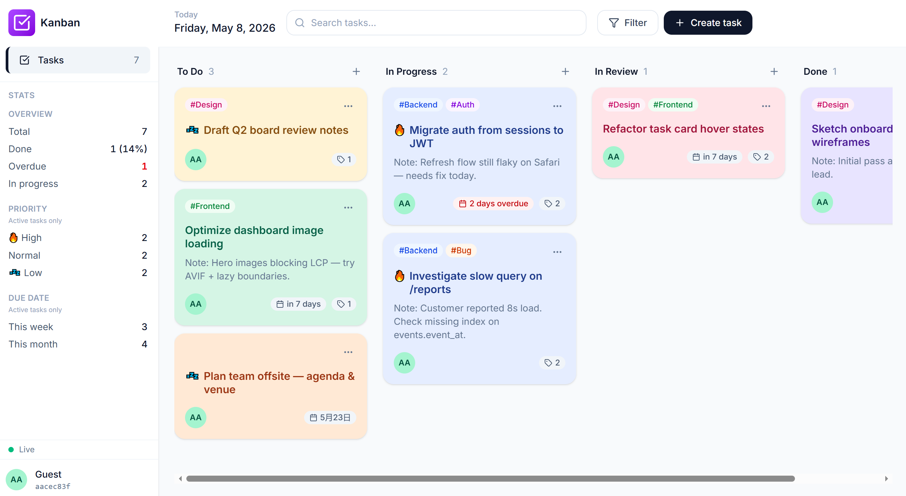

# Kanban Task Board

> Kanban-style task board with realtime multi-tab sync, built with React + Supabase.

## Live Demo

- **Demo:** <https://yx-kanban-task-board.vercel.app/>
- **Repository:** <https://github.com/AlMostShIrlEy/yx-kanban-task-board>



Sign-in is anonymous; the first session seeds 7 demo tasks and 5 labels so the board is never empty.

## Tech Stack

- **Frontend:** React 19 + TypeScript 6, bundled with Vite 8
- **Styling:** Tailwind CSS 4 (CSS-first via `@theme`, no `tailwind.config.js`)
- **Database:** Supabase (Postgres) with Row Level Security
- **Auth:** Supabase Anonymous Auth
- **Realtime:** Supabase Realtime (single channel, three-table subscription)
- **Drag & drop:** `@dnd-kit/core` 6, `@dnd-kit/sortable` 10, `@dnd-kit/utilities` 3
- **Icons:** `lucide-react` 1
- **Toasts:** `sonner` 2
- **Class merging:** `clsx` 2
- **Hosting:** Vercel

## Features

### Core

- Four-column board: To Do, In Progress, In Review, Done
- Drag tasks across columns to change status; drag within a column to reorder
- Create / edit / delete tasks; delete shows a 5-second undo toast before hitting the database
- Anonymous sign-in with idempotent demo seed (7 tasks + 5 labels) on first session
- Realtime multi-tab sync over Supabase channels with a connection-state indicator (Connecting / Live / Reconnecting / Disconnected)

### Bonus (numbering matches the assessment PDF)

- **#4 — Labels:** create, attach, detach, and delete labels; tasks render their labels as colored pills
- **#5 — Due-date severity:** overdue / due-soon / neutral colors on the date badge; the Done column suppresses the badge so completed cards stop nagging
- **#6 — Search & filter:** instant fuzzy match on title / description / label name, plus filters for priority, label set, and due-date window
- **#7 — Stats sidebar:** counts for total / done % / overdue / in-progress / per-priority / due this week / due this month, all from the "what's still open" perspective (Done excluded)

## Setup

### Prerequisites

- **Node.js** 20 or newer (`node --version`)
- **npm** (ships with Node)
- A free **Supabase** account (no paid features used)

### 1. Clone & install

```bash
git clone https://github.com/AlMostShIrlEy/yx-kanban-task-board.git
cd yx-kanban-task-board
npm install
```

### 2. Supabase project

1. Create a new project at <https://supabase.com>. Any region works for evaluation; the default is fine.
2. Open **SQL Editor**, paste the entire contents of [`supabase/migrations/0001_initial_schema.sql`](./supabase/migrations/0001_initial_schema.sql) into a new query, and run it. This creates the three tables (`tasks`, `labels`, `task_labels`), indexes, the `updated_at` trigger, RLS policies, role grants, and the realtime configuration.
3. Enable realtime publication for the three tables. Either:
   - **Dashboard:** *Database → Publications → `supabase_realtime`* → toggle on `tasks`, `labels`, `task_labels`.
   - **SQL Editor:**
     ```sql
     ALTER PUBLICATION supabase_realtime ADD TABLE public.tasks, public.labels, public.task_labels;
     ```
     Skip any table that's already a member — `ALTER PUBLICATION ... ADD TABLE` errors on duplicates.

> **About REPLICA IDENTITY.** `tasks` and `labels` are set to `REPLICA IDENTITY FULL` by the migration so realtime DELETE events carry `user_id` in `payload.old`. Without it, the channel filter `user_id=eq.<id>` drops DELETE events server-side. The migration applies this automatically; the note is here so reviewers don't wonder why it's in the schema.

### 3. Environment variables

Copy the template and fill in your project credentials (Supabase dashboard → *Project Settings → API*):

```bash
cp .env.example .env.local
```

```ini
# .env.local
VITE_SUPABASE_URL=https://<project-ref>.supabase.co
VITE_SUPABASE_ANON_KEY=<anon-public-key>
```

Both variables must be `VITE_`-prefixed so Vite exposes them to the client. The anon key is safe to ship — isolation is enforced by RLS, not key obscurity.

### 4. Run

```bash
npm run dev       # start the dev server at http://localhost:5173
npm run build     # type-check + production build into dist/
npm run preview   # serve the production build locally
npm run lint      # ESLint pass
```

The first time you sign in, the auth provider awaits the demo-seed insert before unblocking the loading screen, so the board renders fully populated rather than briefly empty.

## Project Structure

```
.
├── src/
│   ├── App.tsx                # Top-level layout, search/filter state, modal wiring
│   ├── main.tsx               # React entry
│   ├── index.css              # Tailwind v4 @theme tokens + base layer
│   ├── components/            # Presentational atoms (AvatarBubble, TagPill, Modal, RealtimeStatus, ...)
│   ├── features/
│   │   ├── auth/              # AuthProvider, anonymous sign-in, demo seed
│   │   ├── board/             # TaskBoard, Column, Sidebar, StatsWidget, FilterPopover
│   │   └── tasks/             # TasksProvider, TaskCard, TaskModal, useRealtime, useTasks
│   ├── hooks/                 # Generic reusable hooks
│   ├── lib/                   # supabase client, cn() helper, formatters
│   └── types/                 # Shared TypeScript domain types
├── supabase/
│   └── migrations/            # SQL schema (canonical source of truth)
├── docs/                      # Design reference image
└── public/                    # Static assets served as-is by Vite
```

Conventions:

- Presentational components live in `src/components/`. Stateful, data-owning components live in `src/features/<domain>/`.
- Supabase queries never live in components — they're inside the relevant `features/*/hooks/` or provider.

## Database Schema

The canonical schema is [`supabase/migrations/0001_initial_schema.sql`](./supabase/migrations/0001_initial_schema.sql). Field summary:

### `tasks`

| Column        | Type                | Notes                                              |
|---------------|---------------------|----------------------------------------------------|
| `id`          | uuid PK             | `gen_random_uuid()` default                        |
| `user_id`     | uuid                | FK → `auth.users(id)`, ON DELETE CASCADE           |
| `title`       | text                | NOT NULL, ≤ 200 chars                              |
| `description` | text                | nullable                                           |
| `status`      | text                | `todo` / `in_progress` / `in_review` / `done`      |
| `priority`    | text                | `low` / `normal` / `high`, default `normal`        |
| `due_date`    | date                | nullable                                           |
| `color`       | text                | one of six pastel keys; nullable (auto-hashed UI)  |
| `position`    | double precision    | LexoRank-lite, in-column ordering                  |
| `created_at`  | timestamptz         | `now()` default                                    |
| `updated_at`  | timestamptz         | trigger-maintained on every UPDATE                 |

### `labels`

| Column       | Type        | Notes                                              |
|--------------|-------------|----------------------------------------------------|
| `id`         | uuid PK     | `gen_random_uuid()`                                |
| `user_id`    | uuid        | FK → `auth.users(id)`, ON DELETE CASCADE           |
| `name`       | text        | NOT NULL, ≤ 30 chars; unique per `(user_id, name)` |
| `color`      | text        | one of six pastel keys, NOT NULL                   |
| `created_at` | timestamptz | `now()` default                                    |

### `task_labels` (join)

| Column     | Type | Notes                                       |
|------------|------|---------------------------------------------|
| `task_id`  | uuid | FK → `public.tasks(id)`, ON DELETE CASCADE  |
| `label_id` | uuid | FK → `public.labels(id)`, ON DELETE CASCADE |
| PK         |      | `(task_id, label_id)` composite             |

Three points worth flagging:

- **RLS isolation.** Every table has `auth.uid() = user_id` policies for select/insert/update/delete; `task_labels` joins through `tasks` because it has no `user_id` column. The client never filters by `user_id` — isolation is enforced server-side.
- **PostgREST m2m embed.** Fetching tasks with their labels uses `select('*, labels(*)')`, which traverses `task_labels` automatically via foreign-key detection. No client-side stitching.
- **`REPLICA IDENTITY FULL`** is set on `tasks` and `labels` (not `task_labels`) so realtime DELETE events include the columns the channel filter needs.

## Realtime Architecture

Implementation lives in [`src/features/tasks/hooks/useRealtime.ts`](./src/features/tasks/hooks/useRealtime.ts). Key design points:

- **Single channel, three listeners.** One Supabase Realtime channel subscribes to `postgres_changes` on `tasks`, `labels`, and `task_labels` separately, so the channel-quota cost stays at one regardless of table count.
- **Id-keyed idempotent reducers.** Every event handler is a pure `setState` reducer that finds rows by id; out-of-order delivery, cascade duplicates, and self-echoes all converge to the same state.
- **Server payload wins.** Reconciliation never tries to dedupe by mutation source. Optimistic updates are kept locally and the realtime echo merges over them; a race-aware swap in `createTask` / `createLabel` handles the case where the echo beats the INSERT response.
- **Conditional echo flash.** The green ring fires only when the event represents a real diff against current state, so self-action mutations don't flash (their `setState` already applied the change).
- **Reconnect refetch.** On the second `SUBSCRIBED` for the same channel (i.e. supabase-js auto-reconnected), the hook calls `fetchAll()` to heal anything missed during the drop.

The sidebar connection indicator reflects four states: `connecting` / `live` / `reconnecting` / `disconnected`.

## Tradeoffs

This MVP intentionally drops the assessment's bonus tracks **#1 (Team Members & Assignees)**, **#2 (Comments)**, and **#3 (Activity Log)** so the four shipped bonuses stay polished. Full reasoning — including the realtime design walkthrough and what I'd extend next — is in the assessment write-up PDF (separate deliverable).

## License

[MIT](./LICENSE) © 2026 Yue Xu
